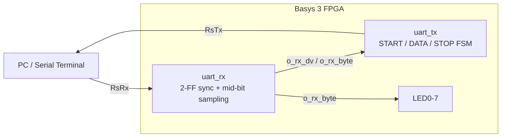

# UART Controller (8N1) — Verilog / Basys 3

A configurable UART transmitter and receiver written in Verilog, verified in simulation with a self-checking loopback testbench, and demonstrated on a Digilent Basys 3 (Artix-7) FPGA as a live serial echo over USB.

> **Status:** Complete and hardware-verified. Typing into a serial terminal echoes back through the FPGA at 115200 baud, with the received byte displayed on the LEDs.

---

## Features

- 8N1 framing (8 data bits, no parity, 1 stop bit), LSB-first
- Parameterizable baud rate via `CLKS_PER_BIT` — same RTL runs at any clock/baud
- Receiver with **mid-bit sampling** and a **2-flip-flop input synchronizer** (proper async clock-domain crossing)
- Self-checking loopback testbench (TX → RX) covering `0xA5`, `0x3C`, `0xFF`, `0x00`
- On-board echo top module mapping to the Basys 3 USB-UART bridge

---

## Block diagram



In the echo design, the receiver's "byte ready" pulse (`o_rx_dv`) and recovered byte (`o_rx_byte`) feed straight into the transmitter's start trigger and data input — so every byte received is immediately retransmitted.

## UART frame (8N1)

```
        start   d0  d1  d2  d3  d4  d5  d6  d7   stop
 idle ──┐     ┌───┬───┬───┬───┬───┬───┬───┬───┐      ┌── idle
   (1)  └─────┤   │   │   │   │   │   │   │   ├──────┘  (1)
        (0)   └───┴───┴───┴───┴───┴───┴───┴───┘
        |<-------------- one frame -------------->|
        each bit held for CLKS_PER_BIT clock cycles
```

Line idles high. A falling edge (start bit = 0) signals a frame; 8 data bits follow LSB-first; a stop bit (1) returns the line to idle.

---

## File structure

```
uart/
├── uart_tx.v             # transmitter
├── uart_rx.v             # receiver (sync + mid-bit sampling)
├── uart_echo_top.v       # top: RX -> TX echo, byte on LEDs (Basys 3)
├── uart_loopback_tb.v    # self-checking TX<->RX testbench
├── uart_echo.xdc         # Basys 3 pin constraints
└── README.md
```

---

## How it works

**Transmitter (`uart_tx.v`).** A 5-state FSM (IDLE → START → DATA → STOP → CLEAN) with a clock counter that holds each bit for `CLKS_PER_BIT` cycles and a bit counter that walks the 8 data bits LSB-first. A one-cycle `i_tx_dv` pulse latches the input byte and starts a frame; `o_tx_done` pulses when the frame completes.

**Receiver (`uart_rx.v`).** The asynchronous input passes through a 2-FF synchronizer to avoid metastability. The FSM waits for the start-bit falling edge, delays half a bit-time to center itself, then samples every `CLKS_PER_BIT` cycles so each sample lands in the middle of a bit (most stable point). On completion it pulses `o_rx_dv` and presents the byte on `o_rx_byte`.

**Baud rate.** `CLKS_PER_BIT = clock_freq / baud_rate`. On the Basys 3 at 100 MHz and 115200 baud that's `≈ 868`. Simulation uses a small value (87) so it runs quickly — identical RTL, different parameter.

---

## Simulate

Requires Icarus Verilog + GTKWave.

```bash
iverilog -o uart_lb_sim uart_tx.v uart_rx.v uart_loopback_tb.v
vvp uart_lb_sim          # expect: 4x PASS, "ALL TESTS PASSED"
gtkwave uart_loopback.vcd
```

## Run on hardware (Basys 3)

1. In Vivado, create a project for part `xc7a35tcpg236-1`.
2. Add `uart_tx.v`, `uart_rx.v`, `uart_echo_top.v` (set `uart_echo_top` as top) and `uart_echo.xdc`.
3. Run Synthesis → Implementation → Generate Bitstream → Program the board.
4. Open a serial terminal (PuTTY/Tera Term) on the board's COM port at **115200, 8N1**.
5. Type a character — it echoes back, and LED0–7 display its bits.

Pins (Basys 3): `clk` = W5 (100 MHz), `RsRx` = B18, `RsTx` = A18.

---

## What I learned

- Designing clocked FSMs with a counter-driven bit timer
- Recovering timing from an asynchronous line via start-bit detection + mid-bit sampling
- Clock-domain crossing and metastability — why every external input needs a synchronizer
- Writing a self-checking testbench, and that stimulus must be synchronized to **DUT readiness** (polling `tx_active`) rather than fixed delays — the bug that caused my loopback test to hang after the first byte
- The full FPGA flow: RTL → constraints → synthesis → bitstream → on-board verification

---

*Built as project #1 in a self-directed path toward RTL / AI-hardware design.*
